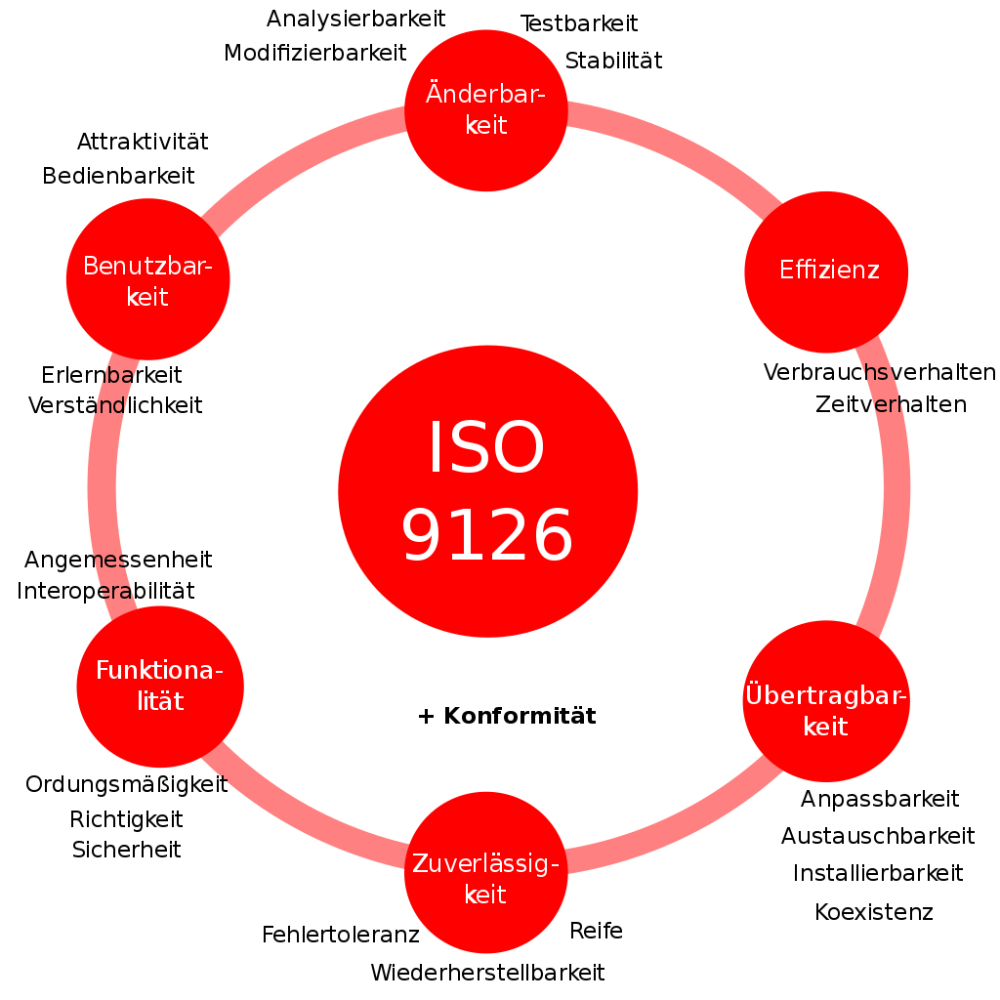
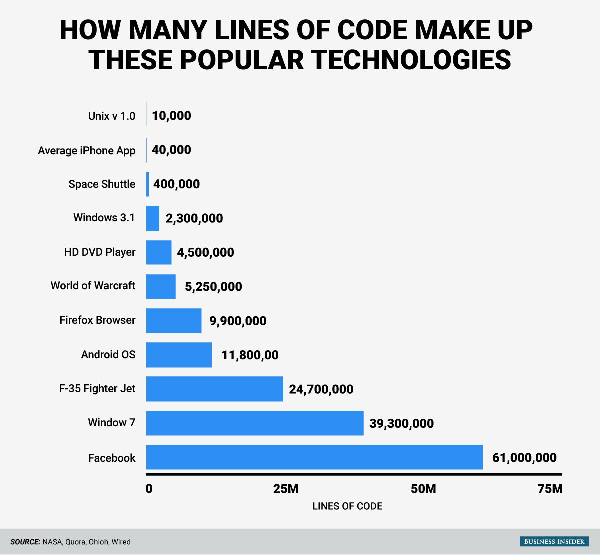
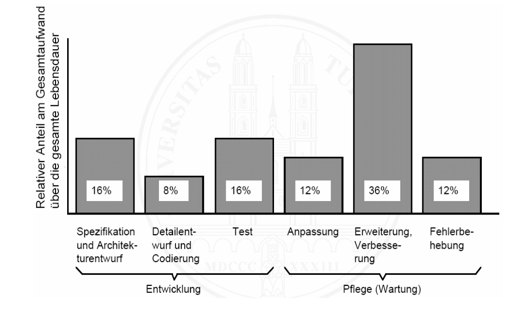
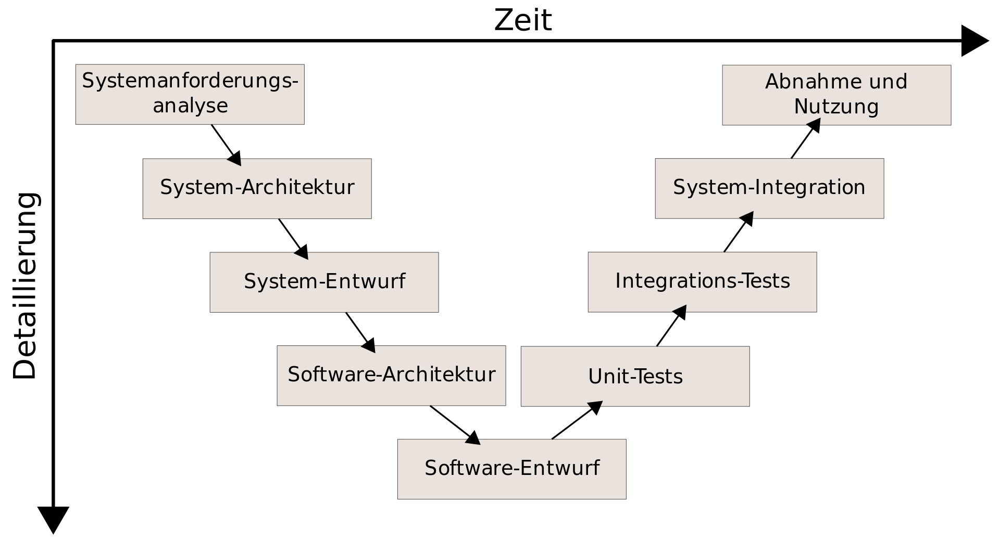

<!--

author:   Sebastian Zug & André Dietrich
email:    zug@ovgu.de   & andre.dietrich@ovgu.de
version:  0.0.1
language: de
narrator: Deutsch Female

import: https://raw.githubusercontent.com/liaScript/rextester_template/master/README.md

-->

# Vorlesung Softwareentwicklung - 0 - Einführung

** TU Bergakademie Freiberg - Sommersemester 2019**

```csharp    HelloWorld.cs
using System;

namespace Rextester
{
    public class Program
    {
        public static void Main(string[] args)
        {
            Console.WriteLine("Glück auf!");
        }
    }
}
```
@Rextester.eval(@CSharp)

## 0 - Organisatorisches

                                    {{0-1}}
*******************************************************************************

**Zielstellung der Veranstaltung**

* Verstehen verschiedener Programmierparadigmen
* Beherrschen von prozeduraler und objektorientierter Programmierung in C#
* Einführung in die Werkzeuge der Softwareentwicklung
* Nutzung moderner und aktueller Programmiertechniken

*******************************************************************************

                                    {{1-2}}
*******************************************************************************

**Dozenten**

| Name             | Email                                      |
|:-----------------|:-------------------------------------------|
| Sebastian Zug    | sebastian.zug@informatik.tu-freiberg.de    |
| Galina Rudolf    | galina.rudolf@informatik.tu-freiberg.de    |
| Jonas Treumer    | jonas.treumer@informatik.tu-freiberg.de    |
| Ben Lorenz       | ben.lorenz@informatik.tu-freiberg.de       |
| Martin Reinhardt | martin.reinhardt@informatik.tu-freiberg.de |

Die Übungen beginnen in der Woche nach den Osterferien, finden dann aber an
zwei Terminen pro Woche statt!

*******************************************************************************


                                    {{2-3}}
*******************************************************************************

**Zeitaufwand und Engagement**

Der Zeitaufwand beträgt 180h und setzt sich zusammen aus 60h Präsenzzeit und
120h Selbststudium. Letzteres umfasst die Vor- und Nachbereitung der
Lehrveranstaltungen, die eigenständige Lösung von Übungsaufgaben sowie die
Prüfungsvorbereitung.

*Sieben Minuten für sieben Punkte* ... Einbettung einer studentischen
Zusammenfassung in jeden Foliensatz. Wir organisieren Sie in Gruppen von 2
Studenten, die zu Beginn jeder Veranstaltung die zentralen Aspekte der  
vorangegangen Vorlesung komprimiert darstellt.

*******************************************************************************


                                    {{3-4}}
*******************************************************************************

**Literaturhinweise**

Literaturhinweise werden zu verschiedenen Themen als Links oder Referenzen
in die Unterlagen integriert.

Es exisitieren eine vielzahl kommerzielle Angebote, die aber einzele Aspekte
in freien Tutorial vorstellen. In der Regel gibt es keinen geschlossenen Kurs
sondern erfordert eine individuelle Suche nach spezifischen Inhalten.

| Medium         | Bemerkung                                                       | Links                                                                              |
| -------------- | --------------------------------------------------------------- | ---------------------------------------------------------------------------------- |
| Online Kurse   | Leitfaden von Microsoft für C# aber auch die Werkzeuge          | [Link](https://docs.microsoft.com/de-de/dotnet/csharp/)                            |
|                | C# Tutorial for Beginners: Learn in 7 Days                      | [Link](https://www.guru99.com/c-sharp-tutorial.html)                               |
|                | Programmierkonzepte von C#                                      | [Link](https://docs.microsoft.com/de-de/dotnet/csharp/programming-guide/concepts/) |
| Videotutorials | Umfangreicher C# Kurs mit guten konzeptionellen Anmerkungen     | [Link](https://www.youtube.com/watch?v=M3lqkuZQBcM&t=2160s)                        |
|                | Einsteigerkurs als Ausgangspunkt für eine Tutorienreihe         | [Link](https://www.youtube.com/watch?v=gfkTfcpWqAY&t=151s)                         |
| Bücher         | J. Albahari, B. Albahari, "C# 7.0 in a Nutshell", O'Reilly 2017 |                                                                                    |
|                | H. Mössenböck, "Kompaktkurs C# 7", dpunkt.verlag                                                                |                                                                                    |

*******************************************************************************


                                    {{4-5}}
*******************************************************************************

**Struktur der Vorlesungsunterlagen**

Hinweis: Die Vorlesung basiert in den ersten Woche in starkem Maße auf dem
Foliensatz von Herrn Dr. Martin Reinhardt, der die Veranstaltung im vergangenen Jahr
gehalten hat.

* Einordnung im Gesamtkontext (Entwicklungsmethodik, C#, Tools)
* Zusammenfassung der letzten Veranstaltung
* ... eigentlicher Inhalt ...
* Beispiel der Woche
* Anhang mit Referenzen und Literaturhinweisen

*******************************************************************************

                                    {{5-6}}
*******************************************************************************

**Vorlesungsplan**

|     | Tag       | Inhalt der Vorlesung   |
|:--- | --------- |:---------------------- |
| 1   | 2. April  | Ausfall                |
|     | 3. April  | Einführung, Grundlagen |
| 2   | 9. April  |                        |
|     | 10. April |                        |
| 3.  | 16. April |                        |
|     | 17. April |                        |
| 4.  | 23. April |                        |
|     | 24. April |                        |
| 5.  | 30. April |                        |
|     |           | ...                    |

*******************************************************************************

                                    {{6-7}}
*******************************************************************************

**Wie können Sie zum Gelingen der Veranstaltung beitragen**

* Stellen Sie Fragen, seinen Sie kommunikativ!
* Organisieren Sie sich in Arbeitsgruppen!
* Experimentieren Sie mit verschiedenen Entwicklungsumgebung um "Ihren Editor"
  zu finden
* Machen Sie Verbesserungsvorschläge für die Vorlesungsfolien!

<!-- width="100%" -->

Link auf den GitHub: https://github.com/liaScript/CCourse

*******************************************************************************

## 1. Softwareentwicklung

                                    {{0-1}}
*******************************************************************************

**Worum geht es, was ist "Softwareentwicklung"?**

| Begriff               | Definitionsansatz                                                                                                                                |
| --------------------- | ------------------------------------------------------------------------------------------------------------------------------------------------ |
| Software als "Medium" | "Software war all das, was zum Funktionieren eines Computers notwendig, aber nicht Hardware ist."                                                |
|                       | "Software ist sinnlich nicht wahrnehmbar ... . Sie ist komplex und besteht aus umfangreichen Texten"                                             |
| Software als Ziel     | "Software macht den Computer nutzbar"                                                                                                            |
|                       | "Software ermöglicht die Abbildung von Prozessen auf einem Rechner"                                                                              |
| Software als Prozess  | "Software ist die Idee, die Lösung, die man sich für ein Problem ausgedacht hat, das Verfahren, das helfen soll ..."                             |
|                       | "Dabei sind Computerprogramme nicht nur als Beschreibung der auszuführenden Funktionen ... Vereinbarung zur Nutzung, ... Dokumentationsinhalte." |

*******************************************************************************

                                    {{1-2}}
*******************************************************************************

*Tessen Freund: Software Engineering durch Modellierung wissensintensiver Entwicklungsprozesse, S. 25*
[Link google books](http://books.google.de/books?id=2HPldlxhBOkC&pg=PA25#v=onepage&q&f=false)

> Unter dem Begriff Softwareentwicklung versteht man die Konzeption
> und standardisierte Umsetzung von Softwareprojekten und die damit
> verbundenen Prozesse.

Abgrenzung zum Softwareengineering

> „Zielorientierte Bereitstellung und systematische Verwendung von Prinzipien,
> Methoden und Werkzeugen für die arbeitsteilige, ingenieurmäßige Entwicklung
> und Anwendung von umfangreichen Softwaresystemen.“ [Balzert, S. 36]

*******************************************************************************

                                     {{2}}
*******************************************************************************

**Was heißt das, "ingenieurmäßig" oder "standardisiert"?**

Gemäß ISO 9126 gibt es die sechs folgenden Qualitätsmerkmale für
Softwareprodukte:

<!-- width="80%" --> [^1]

Nachfolger ISO 25010: Zusätzlich

* Kompatibilität
* Sicherheit

Die Norm kann als eine Art Checkliste verstanden werden.

*******************************************************************************

## 2. Und warum der ganze Aufwand?

{{0-1}}
<!-- width="80%" --> [Weforum]

{{0-1}}
<!-- width="80%" --> [Lemburg]


{{1-2}}
<!-- width="80%" --> [Golem]

```ada
P_M_DERIVE(T_ALG.E_BH) := UC_16S_EN_16NS (TDB.T_ENTIER_16S
                                   ((1.0/C_M_LSB_BH) *
                                   G_M_INFO_DERIVE(T_ALG.E_BH)))
```
*******************************************************************************

                                    {{2-3}}
Toll Connect

                                    {{3-5}}
*******************************************************************************
Und im Kleinen ...

Das folgende anschauliche Beispiel und die zugehörige Analyse entstammt der
Vorlesung "Software Engineering" von Prof. Dr. Schürr, TU Darmstadt.

```pascal
program SORT;
var a, b: file of integer;
    Feld: array [ 1 .. 10 ] of integer;
    i, j, k, l : integer
begin
    open ( a, ‘/Zahlen/Datei’);
    i := 1;
    while not eof ( a ) do
    begin
        read ( a, Feld [ i ] );
        i := i + 1
    end;
    l := i - 1;
    open ( b, ‘/Zahlen/Datei‘);
    for i := 2 to l do
    begin
        for j := l downto i do
            if Feld [ j - 1 ] > Feld [ j ] then
            begin
                k := Feld [j - 1];
                Feld [j - 1] := Feld[ j ]; Feld [ j ] := k
            end;
            write ( b , Feld [ i - 1 ] )
    end
end SORT;
```

Welche Probleme sehen Sie im Hinblick auf die zuvor genannten Qualitätsmerkmale

*******************************************************************************

                                    {{3-4}}
| Aspekt                 | Bewertung |
|------------------------|-----------|
| Funktionalität         | ?         |
| Zuverlässigkeit        |           |
| Benutzbarkeit          |           |
| Effizienz              |           |
| Wartungsfreundlichkeit |           |
| Übertragbarkeit        |           |

                                     {{4}}
| Aspekt                 | Bewertung                                                         |
|-----|-----|
| Funktionalität         | feste Feldlänge, das Programm stürzt bei mehr als 10 Einträgen ab |
| Zuverlässigkeit        | mehrfaches Öffnen ein und der selben Datei                                                                   |
| Benutzbarkeit          | im Programmcode enthaltene Dateinamen, feste Feldlänge            |
| Effizienz              | quadratischer Aufwand der Sortierung                              |
| Wartungsfreundlichkeit | fehlende Dokumentation, unverständliche Variablenbezeichner       |
| Übertragbarkeit        |                                                                   |

## 3. Struktuierung des Entwicklungsprozesses und Einordnung

**Abgrenzung am Beispiel des V-Prozesses**

<!-- width="80%" --> [^3]

**Agile Softwarentwicklung**


TODO


## 4. Computer-aided software engineering (CASE)

> *CASE is the use of computer-based support in the software development process*

**Klassifikation**

Anforderungsanalyse
* Spezifikation
* Modellierung

Code-Erstellung (Editoren)
* Editor, IDE
* Dokumentation

Ausführung und Testen
* Compiler, Interpreter
* IDE, Build-System
* Debugger

Koordination Entwicklungsprozess
* Projektverwaltung
* Code-Base Management und Versionierung
* Deployment
* Support

**Spezifische Werkzeuge oder eine geschlossene Suite?**

* Tools - einzelne Aktivitäten im Software Life-cycle
* Workbenches - mehrere Werkzeuge
* Environments - Kombination mehrerer Workbenches und Werkzeuge zur
  Unterstützung des kompletten Software Life-cycle

Texteditor vs. Integred development environment (IDE)

* Analyse des Workflows und der Formen der Zusammenarbeit
* Analyse der verwendeten Spezifikations und Modellierungstechniken,
  Programmiersprachen, etc.
* Analyse der Komplexität des Vorhabens, der erforderlichen Unterstützung
* Analyse der Rahmenbedingungen (Betriebssysteme, Kosten)

## Anhang

**Referenzen**

*[Golem]* Frank Wunderlich-Pfeiffer, "In den Neunzigern stürzte alles ab",
[Golem](https://www.golem.de/news/softwarefehler-in-der-raumfahrt-in-den-neunzigern-stuerzte-alles-ab-1511-117537.html)

*[Wiki9126]* Wikipedia "ISO/IEC 9126", Autor *Sae1962*

*[Lemburg]* Prof. Dr. Thorsten Lemburg, Einführung in die Softwareentwicklung,
[Link](https://wr.informatik.uni-hamburg.de/_media/teaching/wintersemester_2010_2011/siw-2011-lemburg-einfuehrung_in_die_softwareentwicklung-druckversion.pdf)

*[Weforum]*
Dragan Radovanovic, Kif Leswing, "Google runs on 5000 times more code than the original space shuttle", 2016, [Link](https://www.weforum.org/agenda/2016/07/google-runs-on-5000-times-more-code-than-the-original-space-shuttle?utm_content=buffer45d4c&utm_medium=social&utm_source=twitter.com&utm_campaign=buffer)

*[WikiVModell]* Wikipedia "V Modell", Autor *Michael Pätzold*

**Autoren**

Sebastian Zug, André Dietrich
