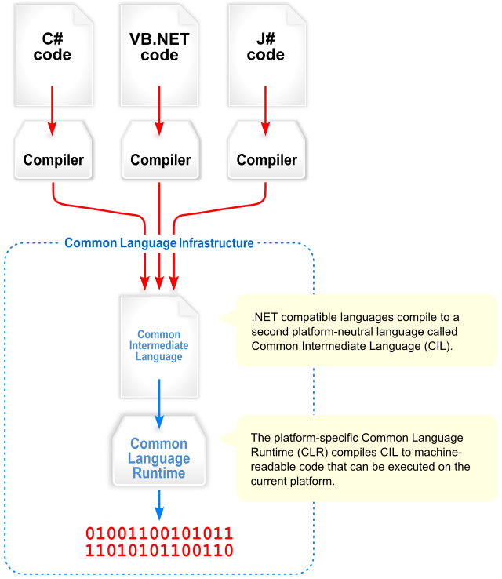

<!--

author:   Sebastian Zug & André Dietrich
email:    zug@ovgu.de   & andre.dietrich@ovgu.de
version:  0.0.1
language: de
narrator: Deutsch Female

import: https://raw.githubusercontent.com/liaScript/rextester_template/master/README.md

-->

# Vorlesung Softwareentwicklung - 1 - Grundlagen

**Fragen an die heutige Veranstaltung ...**

*

---------------------------------------------------------------------
Link auf die aktuelle Vorlesung im Versionsmanagementsystem GitHub

https://github.com/liaScript/CsharpCourse/blob/master/01_EinordnungCsharp.md

Die interaktive Form ist unter diese Link zu finden ->
[LiaScript Vorlesung 1](https://liascript.github.io/course/?https://raw.githubusercontent.com/liaScript/CsharpCourse/master/01_EinordnungCsharp.md#1)
---------------------------------------------------------------------

## 1. Programmierparadigmen

{{0-1}}
Ein Programmierparadigma bezeichnet die gedankliche, konzeptionelle Grundstruktur
die der Darstellung des Problems in Code zugrunde liegt.

{{0-1}}
Das Programmierparadigma:

{{0-1}}
* beschreibt den fundamentalen Programmierstil bzw. Eigenschaften von Programmiersprachen
* unterscheidet sich durch die Repräsentation der statischen und dynamischen Programmelemente
* Paradigma beruht auf Sprache, aber auch auf individuellem Stil.

{{1-4}}
<!--
style="width: 95%; max-width: 960px; display: block; margin-left: auto; margin-right: auto;"
-->
````````````
                                 Programmierparadigmen
                                           ┃
                         ┏━━━━━━━━━━━━━━━━━┻━━━━━━━━━━━━━━━━━━━━━━┓
            Imperative Programmierung                 Deklarative Programmierung
                       ┃                                          ┃
      ┏━━━━━━━━━━━━━━━━╋━━━━━━━━━━━━━━━┓                 ┏━━━━━━━━╋━━━━━━━━━┓
 Strukturiert    Prozedural    Objektorientiert    Funktional   Logisch    ....  

````````````
{{1-2}}
**Imperative Programmierung** ... Quellcode besteht aus einer Folge von Befehlen die in einer festen Reihenfolge abgearbeitet werden.

{{1-2}}
     + **Strukturierte  Programmierung** ... Verzicht bzw. Einschränkung des `Goto` Statements zugunsten von Kontrollstrukturen (Kernkonzepte: Verzweigungen,
     Schleifen)

{{1-2}}
     + **Prozedurale Programmierung** ... Zerlegung von Programmen in überschaubare Teile, die durch eine definierte Schnittstelle aufrufbar sind (Kernkonzepte: Funktion, Prozedur, Routine, Unterprogramm)

{{1-2}}
     + **Objektorientierte Programmierung** ... Kapselung von Daten und Funktionen in einem Konzept

{{1-2}}
**Deklarative Programmierung** ... • Es wird kein Lösungsweg implementiert, sondern nur angegeben, was gesucht ist.

{{1-2}}
     + **Funktionale Sprachen** ... Abbildung der Algorithmen auf funktionale Darstellungen

{{1-2}}
```haskell    prologBeispiel.cs
% Definition einer Funktion
fac 0 = 1
fac n = n * fac (n-1)

% Berechnung eines Ergebnisses
main = print (fac 42)
```
@Rextester.eval(@Haskell)

{{1-2}}
     + **Logische Sprachen** ... Ableitung einer Lösung aus einer Menge von Fakten

{{1-2}}
```prolog    prologBeispiel.cs
% Prolog Text mit Fakten
mann(adam).
mann(tobias).
mann(frank).
frau(eva).
frau(daniela).
frau(ulrike).
vater(adam,tobias).
vater(tobias,frank).
vater(tobias,ulrike).
mutter(eva,tobias).
mutter(daniela,frank).
mutter(daniela,ulrike).
%       ?- mann(tobias).
```
@Rextester.eval(@Prolog)

{{1-2}}
     + **Abfragesprachen** ... Generierung einer Auswahl von Daten

{{1-2}}
     + **Nebenläufig**, **Reflektiv**, **Generisch**, ...

{{2}}
Viele Sprachen unterstützen verschiedene Elemente der Paradigmen, bzw. entwickeln
sich in dieser Richtung weiter.

{{2}}
| Sprache | Paradigmen                                          |
| ------- | --------------------------------------------------- |
| Pascal  | imperativ, prozedural                               |
| C       | imperativ, prozedural                               |
| Ada     | imperativ, objektorientiert                         |
| Java    | imperativ, objektorientiert                         |
| Python  | imperativ, objektorientiert, funktional             |
| C#      | imperativ, prozedural, objektorientiert, funktional |                                                    |
| C++     | imperativ, prozedural, objektorientiert, funktional |
| Haskell | deklarativ, funktional                              |
| Prolog  | deklarativ, Logisch                                 |
| SQL     | deklarativ, Abfragesprache                          |

{{3}}
"Das ist ja alles gut und schön, aber ich ich bin C Programmierer"

{{3}}
> **Anti-Pattern Golden Hammer**: *if all you have is a hammer, everything looks like a nail.*

## 2. --- Warum also C#

C# wurde unter dem Codenamen *Cool* entwickelt, vor der Veröffentlichung aber
umbenannt. Der Name C Sharp leitet sich vom Zeichen Kreuz (♯, englisch sharp)
der Notenschrift ab, was dort für eine Erhöhung des Grundtons um einen Halbton
steht. C sharp ist also der englische Begriff für den Ton *cis* (siehe
Anspielung auf C++)

C#

+ ist eine moderne und durchdachte Sprache
+ enthält Elemente vieler verschiedener Paradigmen
+ ist plattformunabhängig
+ bietet eine breite Sammlung von Bibliotheken
+ integriert Bibliotheken und Konzepte für die GUI-Programmierung
+ kann mit anderen Sprachen über .NET interagieren
+ unterstützt Multi-Processing problemlos
+ ist typsicher
+ ...

### Historie

+ Version 1.0 im Jahre 2002
+ Aktuell: C# 7.2 (16.08.2017), die Version 8.0 ist angekündigt und einige Sprachfeatures bereits publiziert

### Konzepte

**Compilierung unter C** (zum Vergleich)

<!-- width="80%" --> [^1]


**??????**

Die Common Language Infrastructure (CLI) ist eine von Microsoft entwickelte und von ISO und ECMA standardisierte offene Spezifikation (technischer Standard), die ausführbaren Code und eine Laufzeitumgebung beschreibt, in der mehrere High-Level-Sprachen (C#. Visual Basic, F#) kombiniert und plattformunabhängig ausgeführt werden können. Das .NET Framework, .NET Core, Mono, DotGNU und Portable.NET sind Implementierungen der CLI.


 <!-- width="80%" -->[^2]


```cil
.assembly HalloWelt { }
.assembly extern mscorlib { }
.method public static void Main() cil managed
{
    .entrypoint
    .maxstack 1
    ldstr "Hallo Welt!"
    call void [mscorlib]System.Console::WriteLine(string)
    ret
}
```


### Abgrenzung zu Java und C++


void *memcpy (void* destination, const void* source, size_t num);


## 4. Es wird konkret ... Hello World

```csharp    HelloWorld.cs
using System;

namespace Rextester // This namespace is necessary for Rextester API !
{
    public class Program
    {
        public static void Main(string[] args)
        {
            Console.WriteLine("Hello, world!");
        }
    }
}
```

*A) LiaScript Umgebung*

```csharp    HelloWorld_rex.cs
using System;

namespace Rextester // This namespace is necessary for Rextester API !
{
    public class Program
    {
        public static void Main(string[] args)
        {
            Console.WriteLine("Hello, world!");
        }
    }
}
```
@Rextester.eval(@CSharp)


*B) Mono Kommandozeile*

``` bash @output
▶ mcs helloWorld.cs

▶ ls
helloWorld.cs  helloWorld.exe

▶ mono helloWorld.exe
Hello, world!
```

Eine ausführliche Hilfe findet sich unter https://www.mono-project.com/docs/getting-started/mono-basics/
(Allerdings ist dort ein Typo passiert statt des Mono-Compilers wird der .NET
Compiler aufgerufen. Bitte genau hinschauen.)

*C) Monodeveloper*

<!-- width="80%" --> [ref](#8) [^3]


*D) .NET Kommandozeile*


*E) .NET Visual Code*


Evaluieren Sie auch den interaktiven Modus mit gsharp, csharp oder dem .NET
Interpreter unter Visual Studio.


## Anhang

**Referenzen**

[^1]: Abbildung Stufen der Compilierung (Quelle: https://medium.com/@vietkieutie/what-happens-when-you-type-gcc-main-c-2a136896ade3)

[^2]: Wikipedia "Visual overview of the Common Language Infrastructure (CLI)", Autor *Jarkko Piiroinen*

[^3]:

**Autoren**

Sebastian Zug, André Dietrich
